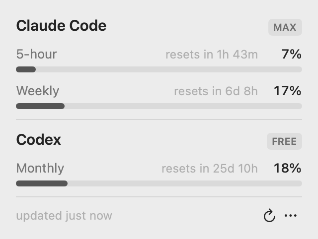

# UsageBar

A macOS menu bar app that shows how much of your Claude Code and Codex usage limits you have burned. Click the icon, see every window with a percentage and a reset time.

<picture>
  <source media="(prefers-color-scheme: dark)" srcset="docs/screenshot-dark.png">
  
</picture>

## Install

```bash
curl -fsSL https://raw.githubusercontent.com/lucas-barake/usagebar/main/install.sh | bash
```

Installs to `/Applications` and launches. To update, run it again. To remove it, quit the app and delete `/Applications/UsageBar.app`.

macOS asks once for keychain access the first time it reads Claude's token. Click **Always Allow**.

Requires macOS 14 or newer.

## What it shows

Both CLIs are probed independently. Whichever ones answer get a section; if neither answers, the popover says why for each.

- **Claude Code** — the 5-hour and weekly windows of your Claude.ai subscription.
- **Codex** — whichever windows your ChatGPT plan reports. Paid plans have a 5-hour and a weekly window; free accounts have a single monthly one.

Usage refreshes every 5 minutes and whenever you press refresh.

Under **⋯ → Show in Menu Bar**, pick whether the menu bar number tracks Claude Code, Codex, or whichever of the two is highest. A single number always reports the long window — weekly, or monthly on a free Codex plan — so it never changes meaning under you. To see the 5-hour too, pin one provider and turn on **Show Both Windows**, which stacks the two readings as `5h 9%` over `7d 17%`. Both choices are remembered across restarts.

## How it reads the numbers

- **Codex** exposes usage over its app-server protocol. UsageBar runs `codex app-server` and calls `account/rateLimits/read`.
- **Claude Code** has no non-interactive usage command, so UsageBar does what the `/usage` screen does: it reads the OAuth token Claude Code already stored in your keychain and calls `GET /api/oauth/usage`. The token is only ever sent to `api.anthropic.com`, and it is never written back or refreshed. If it has expired, run `claude` once and it refreshes itself.

Nothing is uploaded anywhere else, and there is no config file.

## Build from source

```bash
./scripts/install-app.sh
```

`./.build/release/usagebar --render-preview <dir>` writes PNGs of the popover in light and dark, with live and fixture data. That is how the screenshots above are made, and it is the only way to check the UI on a machine without Screen Recording permission.

## License

MIT
